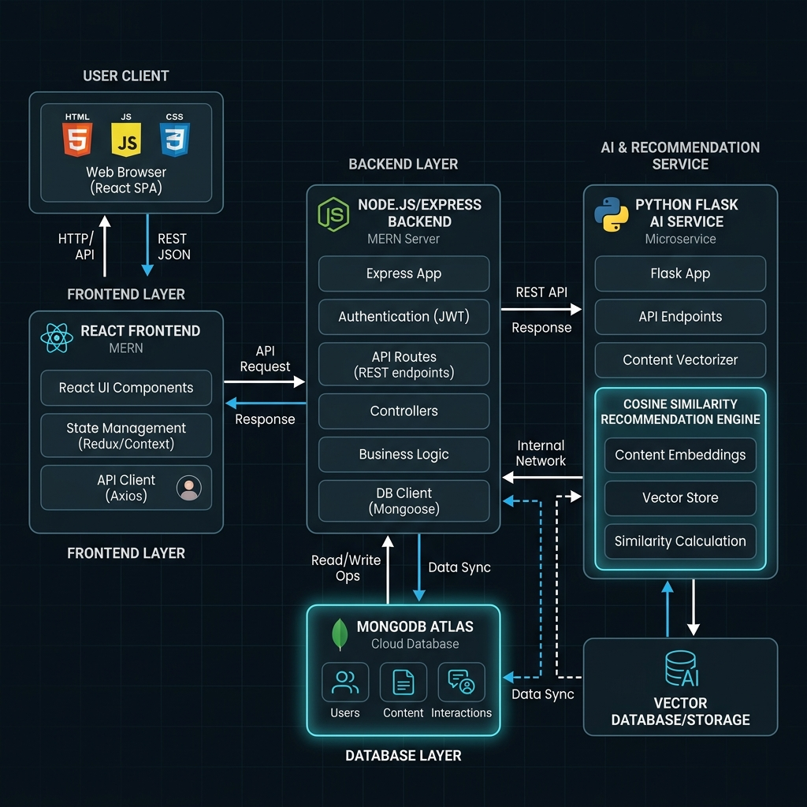

# 🛍️ ShopEZ: AI-Enhanced Secure MERN E-Commerce Store

<div align="center">

[](https://github.com/induridharani-19/ShopEZ/actions)
[](LICENSE)
[](https://nodejs.org/)
[](https://react.dev/)
[](https://www.python.org/)
[](https://www.mongodb.com/cloud/atlas)
[](https://www.docker.com/)
[](https://github.com/induridharani-19/ShopEZ/actions)

</div>

**ShopEZ** is a professional, secure, and smart e-commerce platform engineered with the MERN stack (MongoDB, Express, React, Node.js) and integrated with an AI recommendation and conversational commerce microservice.

---

## 🎨 System Architecture

Below is the high-level software architecture diagram representing client interaction flow, REST middleware API gates, and the machine learning recommendation subsystem:



---

## 🚀 Key Features

### 🛡️ 1. Role-Based Access Control (RBAC) & Route Security
- **JWT Middleware Encryption**: Secure login sessions and registration endpoints.
- **Admin Privilege Guardians**: All database modifications (catalog updates, deleting users) are guarded at the Node.js API layers.
- **Protected Layouts**: React router blocks customers from accessing administrative views.

### 🤖 2. Content-Based Recommendation Subsystem
- **TF-IDF & Cosine Similarity**: Analyzes text categories and product profiles to suggest 5 matching items.
- **Flask Microservice**: Deployed as an independent Python Flask server.
- **Node.js Native Fallback**: Express handles document vector similarity automatically if the Flask server is down, maintaining full storefront uptime.

### 💬 3. Interactive AI Advisor (Chatbot)
- **Natural Language Parsing**: Translates user search intents (e.g. *"Show me beauty products"*) into actual product query scores.
- **Interactive Drawer Interface**: Floating chat panels presenting clickable product card lists.

---

## 🛠️ Technology Stack

| Component | Technology | Version | Description |
| :--- | :--- | :---: | :--- |
| **Frontend** | React SPA | `v19` | Client dashboard compiled via Vite |
| **Backend** | Node / Express | `v18+` | REST API gateway & database connector |
| **Database** | MongoDB Atlas | `v6` | Mongoose ORM cloud storage cluster |
| **AI Module** | Flask / Python | `v3.9` | Vectorization model training & suggestion api |
| **CI/CD** | GitHub Actions | - | Automated lint, build, and test verification runners |
| **Container** | Docker / Compose | - | Orchestrates client, node server, and Flask AI nodes |

---

## 📂 Repository Structure

For a complete folder and file list representation, see [project_structure.md](docs/project_structure.md).

---

## ⚙️ Local Development Setup

To run the application locally, navigate to each directory, duplicate the environment examples to initialize your configs, and install dependencies:

### 1. Backend Configuration
Copy the example environment template and fill in your connection details:
```bash
cd backend
cp .env.example .env
```
Open `backend/.env` and set your `MONGO_URI` and `JWT_SECRET`.

Install dependencies and run the developer hot-reload server:
```bash
npm install
npm run dev
```

### 2. Frontend Configuration
Copy the example environment template and configure your api endpoints:
```bash
cd ../ShopEZ
cp .env.example .env
```
Open `ShopEZ/.env` and set `VITE_API_URL=http://localhost:5000/api`.

Install dependencies and start the Vite dev server:
```bash
npm install
npm run dev
```

### 3. AI Flask Server Setup
```bash
cd ../ai_module
pip install -r requirements.txt
python train_recommender.py
python ai_server.py
```

---

## 🧪 Running QA Test Suites
To verify authentication, authorization middleware, API integrations, and the Javascript recommendation fallbacks:
```bash
cd backend
node tests/run_tests.js
```
*Results summary: 6/6 tests passing successfully.*

---

## 📊 AI Model Metrics
The Content-Based Recommendation system is evaluated using Precision@K, Recall@K, and F1-Score metrics calculated against seeded user purchase and description overlaps:

- **Precision@3**: `0.7900`
- **Recall@3**: `0.3099`
- **F1-Score@3**: `0.4452`

Refer to [Testing Report](docs/Testing_Report.pdf) and [AI Documentation](docs/testing.md#2-ai-model-performance-validation) for further verification.

---

## 📖 Key Project Documents
For detailed guides, specifications, and project slides, refer to:
- [API Documentation Link](docs/API.md)
- [Cloud Deployment Manual](docs/deployment.md)
- [QA Testing Plans](docs/testing.md)
- [Project Highlights Summary](docs/highlights.md)
- [Final Project Report (PDF)](docs/Final_Project_Report.pdf)
- [UAT Acceptance Matrix (PDF)](docs/UAT_Report.pdf)
- [Project Slide Presentation (PPTX)](docs/ShopEZ_Presentation.pptx)

---

## 🖼️ Screenshots Evidence
Refer to the [Screenshots Directory](screenshots/README.md) to inspect captured UI layouts (Home, Register, Products list, Cart checkout, Order history, and ML Classification graphs).

---

## 🔮 Future Enhancements
- Integrate Stripe payment gateways.
- Add user reviews and rating aggregations.
- Implement collaborative filtering for user interaction data.

---

## 📄 License
This project is licensed under the MIT License. See [LICENSE](LICENSE) for details.
