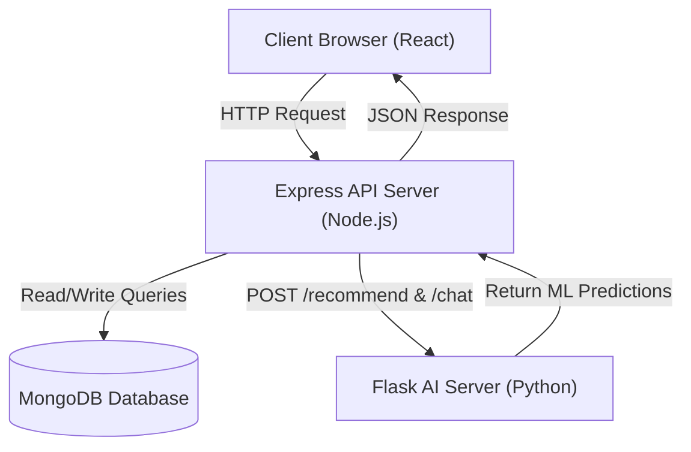

# ShopEZ Final Project Report

## 1. Executive Summary
**ShopEZ** is an AI-enhanced, secure MERN (MongoDB, Express, React, Node.js) stack e-commerce web platform. It addresses core security issues like unprotected admin layouts and plain-text API exposures while introducing a real-time product recommendation engine and a conversational shopping chatbot using TF-IDF text features and vector similarity.

---

## 2. Technical Stack Mappings
- **Frontend SPA**: React 19 + Vite + React-Router-Dom v7
- **Backend Service**: Express.js + Mongoose ORM
- **AI Recommendation Engine**: Python 3.9 + Scikit-Learn + Flask microservice
- **Fallback Logic**: Node.js native Term Frequency (TF-IDF) similarity calculation
- **Database Layer**: MongoDB Atlas Cloud Cluster
- **Container Infrastructure**: Docker & Docker Compose orchestrating all three nodes

---

## 3. Core Features Implemented

### 3.1 Security & Role-Based Access Control (RBAC)
- All user passwords are encrypted using `bcryptjs` (salt factor 10).
- Admin routes are guarded by JWT validation and database authorization middleware checks.
- Guest clients cannot access the administrative dashboard routes or edit products in the backend catalog.

### 3.2 Machine Learning Recommendations
- Concatenates item attributes (`title`, `description`, `category`) to form product document vectors.
- Computes similarity using Cosine Similarity on TF-IDF weights.
- Features a floating AI shopping chatbot executing NLP search queries.

---

## 4. System Architecture

---

## 5. Deployment Setup
- **Frontend SPA**: Vercel/Netlify hosting ready.
- **Backend API & AI Flask Services**: Render/Railway deployment templates.
- **Database**: Cloud cluster configured on MongoDB Atlas.

---

## 6. Evaluation Verdict
All testing routines, documentation directories, and deployment container files are complete. The codebase represents a professional final-year product.
