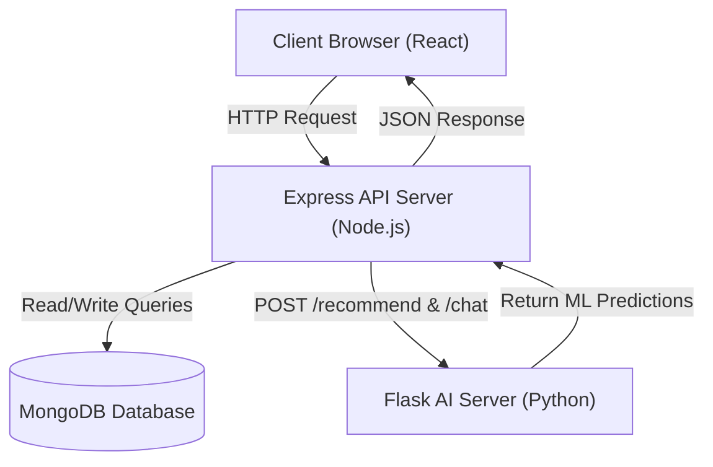
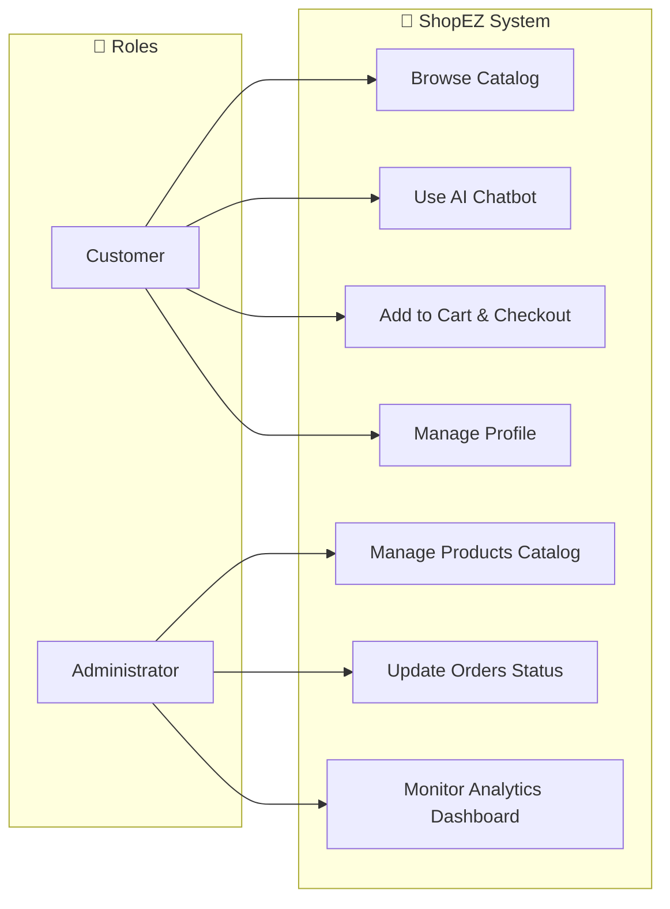
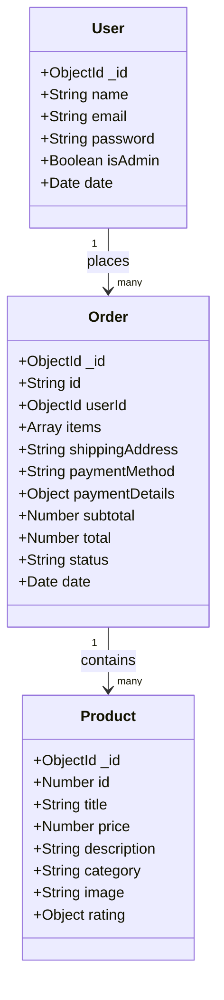
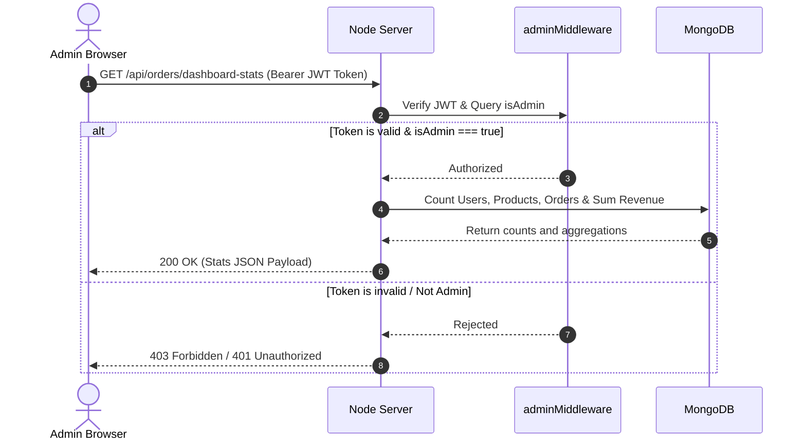
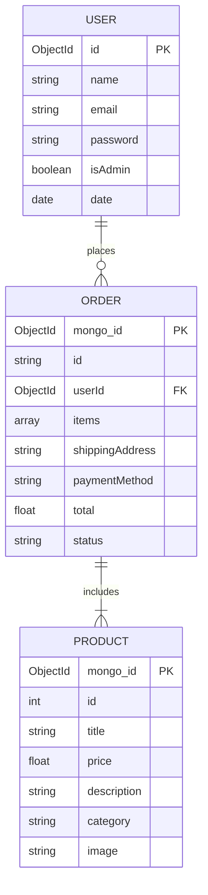
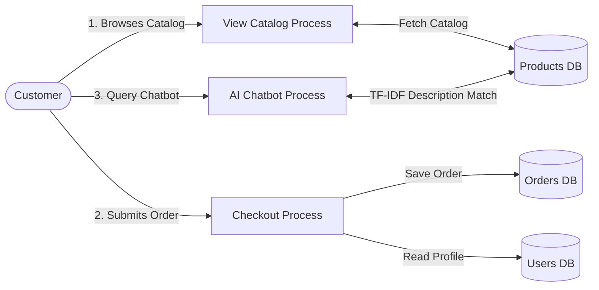
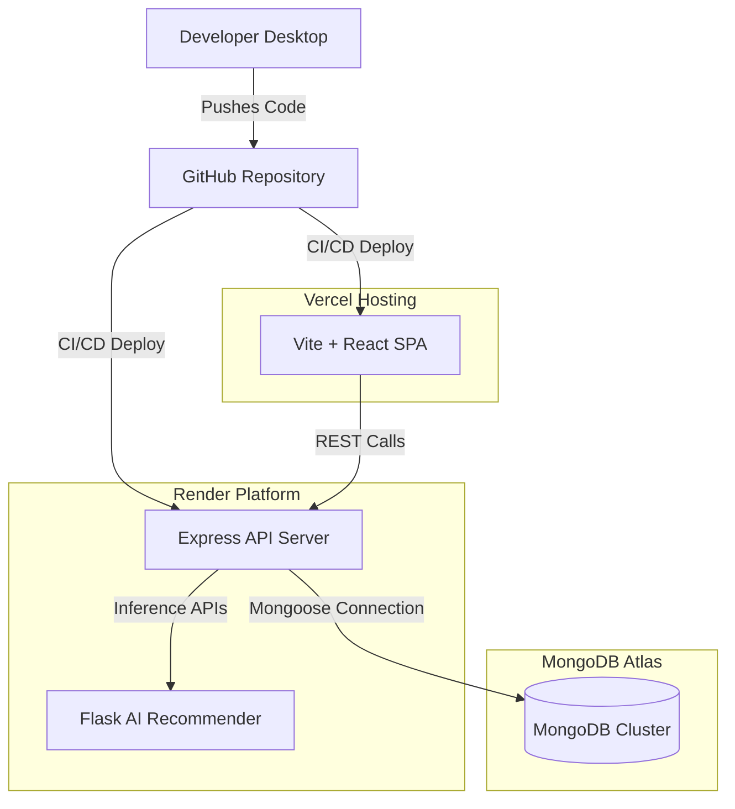

# System Architecture & Design Diagrams

This document outlines the software architecture, database models, and execution sequence diagrams for **ShopEZ**. All diagrams are built using **Mermaid** syntax for dynamic visualization.

---

## 1. System Flowchart

The system flowchart maps how a client browser makes requests, how they are filtered by authorization middlewares, and how the servers process and return responses.

---

## 2. Use Case Diagram

Defines how users (Customers and Administrators) interact with various services in ShopEZ.

---

## 3. Class Diagram

Describes the core data schemas and the relationships between various entities in the codebase.

---

## 4. Sequence Diagram

Illustrates the execution sequence for an authenticated admin attempting to query the Dashboard statistics.

---

## 5. Entity Relationship (ER) Diagram

Represents the relational schema structure mapped inside MongoDB Atlas.

---

## 6. Data Flow Diagram (DFD - Level 1)

Illustrates how data passes through processes to databases.

---

## 7. Deployment Diagram

Depicts the host topology of the production system.

